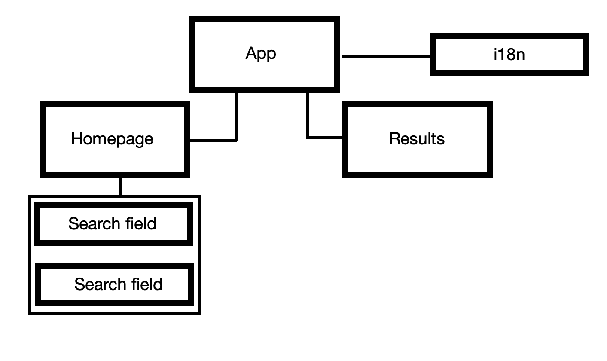

# Portfolio project wheelerz

wheelerz is a portfolio project that shows the benefits of taking the bike over the car. You put in a starting point and and an end point. After hitting the “convince me” button 3 different argument are shown, that should convince you to take the bike. Goal of the project is to get a better understanding of API calls. 

## Technologies

- React
- i18n
- TailwindCSS
- TomTom API / Tankerkönig API

## Features

- Fuzzy search
- API request
- Change the language of the app
- Passing data between different components

## Structure

The App.js component shows the whole app and is divided in two sections. The first section is the homepage and the second section shows the results. Always visible is the option to change the language. 

To get the results from the search fields to the result component, it is necessary to pass data through different components. To get the data from the search field into the App component (FuzzySearch.js —> Search.js —> App.js) the respectively parent element puts a function as a prop to the child element. This function would set the data in an useState hook.

As soon as the getLocation() function in the App.js component is triggered, the Result.js component is rendered. With help of the TomTom API the distance is calculated. The Tankerkönig API gives the prices per liter. The TomTom API call ist with Promise and the Tankerkönig API call is with async/await. All the other calculations are hard coded and are based on different assumptions. 